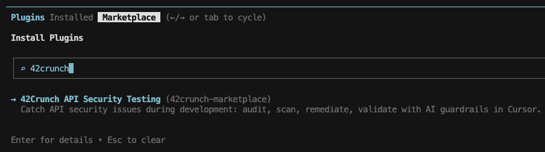
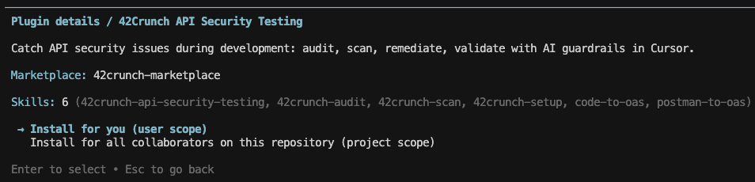
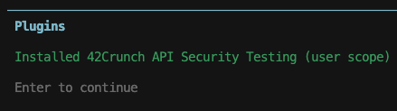

# 42Crunch Cursor Plugins

The official [42Crunch](https://www.42crunch.com) plugin marketplace for Cursor — a catalog of AI-powered plugins that bring 42Crunch's API security capabilities directly into your Cursor workflow.

42Crunch plugins give Cursor the ability to audit OpenAPI specs, scan live APIs for vulnerabilities, and apply fixes to ensure APIs meet security guardrails.

## Structure

```
.cursor-plugin/
  marketplace.json              # Plugin registry manifest
docs/                           # Repository-level documentation assets
  images/                       # Screenshots and diagrams used in READMEs
plugins/                        # Cursor plugins developed by 42Crunch
  42crunch-api-security-testing/
    .cursor-plugin/
      plugin.json               # Plugin metadata
    skills/                     # Skill definitions
    references/                 # Reference definitions
    README.md                   # Documentation
    LICENSE                     # License
```

## Prerequisites

The [Cursor CLI](https://cursor.com/cli) is required to add marketplaces and install plugins using the `agent` CLI commands below.

## Adding this Marketplace

Register the 42Crunch marketplace with Cursor:

#### Using Cursor CLI interactive session

1. In terminal/command prompt, type `agent` and press **Enter** to run the Cursor CLI agent.

2. Add the 42Crunch Marketplace:
```
/plugin marketplace add https://github.com/42Crunch-AI/cursor-plugins
```

## Available Plugins

### [42crunch-api-security-testing](./plugins/42crunch-api-security-testing/)

AI-powered API security plugin backed by 42Crunch. Audit OpenAPI specs, detect OWASP API Security vulnerabilities (including BOLA/BFLA), run live conformance and authorization scans against running APIs, and apply AI-assisted fixes — all through natural language.

**Install:**
After registering the marketplace (see above), install the plugin:

#### Using Cursor CLI interactive session

1. In terminal/command prompt, type `agent` and press **Enter** to run the Cursor CLI agent.

2. Type `/plugin` to open the plugin manager.

3. Navigate to **Marketplace** using the right-arrow key and search for the 42Crunch plugin:
  - Type '42crunch' in the search bar
  - Press **Enter** to select the 42Crunch API Security Testing plugin



5. Select the scope of installation:



6. Press **Enter** to install:



See the [plugin README](./plugins/42crunch-api-security-testing/README.md) for full documentation and [RECIPES.md](./plugins/42crunch-api-security-testing/RECIPES.md) for common scenario guides.


## Links

- [42Crunch](https://42crunch.com/)
- [42Crunch Documentation](https://docs.42crunch.com)
- [42Crunch on GitHub](https://github.com/42Crunch)
- Support: support@42crunch.com
